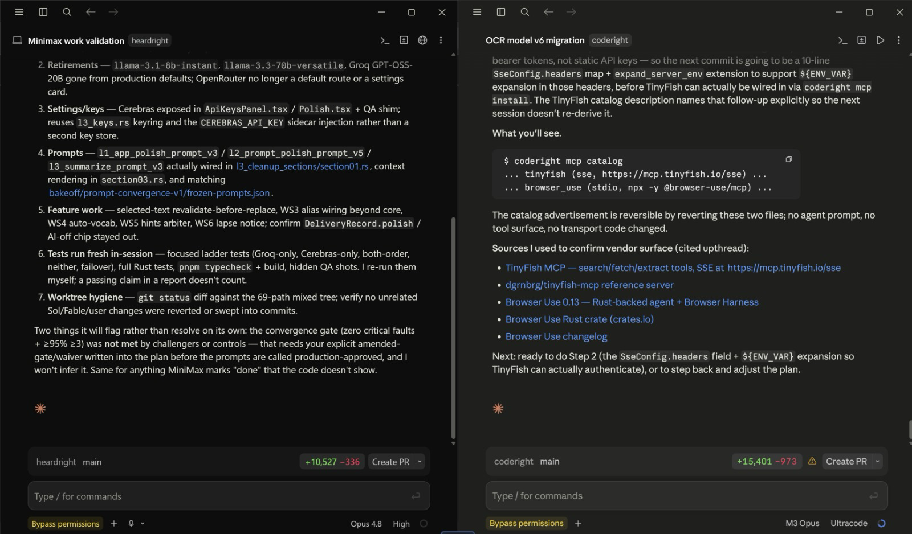

<h1 align="center">
  
</h1>

<p align="center"><strong>Run Claude Code and Claude Desktop on any Anthropic-compatible model.</strong></p>

<p align="center">
  MiniMax · GLM · Kimi · LiteLLM · vLLM · local models<br>
  <a href="#quick-start">Quick start</a> · <a href="#choose-a-surface">Choose a surface</a> · <a href="docs/macos.md">macOS guide</a> · <a href="#troubleshooting">Troubleshooting</a>
</p>



<p align="center"><sub>Subscription Claude and a gateway-backed Claude Desktop running side by side.</sub></p>

Keep your Anthropic subscription and run a second model beside it. `anyclaude` is a small, standard-library Python proxy that translates Claude's required `claude-*` model names into the model names used by Anthropic-compatible providers.

```text
Claude Code / Claude Desktop
           │ Anthropic Messages API, model=claude-*
           ▼
    anyclaude · 127.0.0.1:8801
           │ same request, renamed model + provider key
           ▼
 MiniMax / GLM / Kimi / local gateway
```

No Claude fork. No patched binary. No additional Electron download. Your provider key stays in an environment variable and the proxy listens on localhost only.

## What is verified

| Provider | Endpoint | Verified |
|---|---|---|
| **MiniMax M3** | `api.minimax.io/anthropic` | Claude Code + Desktop, Windows + macOS |
| Zhipu **GLM** | `open.bigmodel.cn/api/anthropic` | Example config; not yet tested |
| Moonshot **Kimi** | `api.moonshot.ai/anthropic` | Example config; not yet tested |
| **Local gateway** | `127.0.0.1:<port>` | Example config; not yet tested |

Only MiniMax is currently verified. Other entries describe compatible configurations, not confirmed support.

## Choose a surface

| Surface | Use it when | Isolation |
|---|---|---|
| **Claude Code CLI** | You want the simplest setup or a shell alias | Your normal terminal permissions |
| **Claude Desktop, direct** | You are happy to switch the stock app between Anthropic and a gateway | Reuses the stock Desktop profile |
| **Claude Desktop, second instance** | You want subscription Claude and a gateway model side by side | Separate Desktop, Claude Code, and Cowork state |

## Quick start

### Prerequisites

- Python 3.9 or newer
- Claude Code and/or the latest Claude Desktop
- An Anthropic-compatible provider endpoint and API key
- `curl` for the verification command

### 1. Clone and configure

```bash
git clone https://github.com/bogusyogi/anyclaude.git
cd anyclaude
cp examples/minimax.json config.json
```

Use `glm.json`, `kimi.json`, or `local.json` instead when appropriate. `config.json` is ignored by Git.

```json
{
  "port": 8801,
  "upstream": {
    "host": "api.minimax.io",
    "prefix": "/anthropic",
    "scheme": "https",
    "auth_header": "x-api-key",
    "key_env": "MINIMAX_API_KEY"
  },
  "models": {
    "default": { "name": "MiniMax-M3", "thinking": "adaptive" },
    "haiku": { "name": "MiniMax-M3", "thinking": "disabled" }
  }
}
```

- `key_env` is the name of the environment variable containing the provider key. Never put the key in `config.json`.
- `models` matches a keyword in the incoming Claude model name. `default` is the fallback.
- A `haiku` route with thinking disabled provides a fast lane. Routes can also point to different upstream models.

### 2. Set the provider key

macOS or Linux:

```bash
export MINIMAX_API_KEY="sk-..."
```

Add the export to `~/.zprofile` on macOS if a login service will start the proxy. Use `~/.zshrc` or `~/.bashrc` for terminal-only use.

Windows PowerShell:

```powershell
setx MINIMAX_API_KEY "sk-..."
```

Open a new terminal after `setx`.

### 3. Start and verify the proxy

```bash
python3 proxy.py
```

In a second terminal:

```bash
curl -fsS http://127.0.0.1:8801/health
```

This checks the local proxy without contacting the provider. Then run one real routing test:

```bash
curl -fsS http://127.0.0.1:8801/v1/messages \
  -H "x-api-key: router-dummy" \
  -H "anthropic-version: 2023-06-01" \
  -H "content-type: application/json" \
  -d '{"model":"claude-opus-4-8","max_tokens":16,"messages":[{"role":"user","content":"ping"}]}'
```

Success means the response names the upstream model and `proxy.log` records `status=200`. This request consumes a small provider inference call.

## Use Claude Code CLI

```bash
export ANTHROPIC_BASE_URL="http://127.0.0.1:8801"
export ANTHROPIC_AUTH_TOKEN="router-dummy"
export ANTHROPIC_MODEL="claude-opus-4-8"
export ANTHROPIC_DEFAULT_HAIKU_MODEL="claude-haiku-4-5-20251001"
claude
```

Put these in a shell function or alias such as `anyclaude`; leave plain `claude` on your Anthropic subscription. `/status` should show the local proxy URL.

## Use Claude Desktop directly

Open **Developer → Configure Third-Party Inference** and set:

| Setting | Value |
|---|---|
| Provider | Gateway |
| Base URL | `http://127.0.0.1:8801` |
| Credential kind | Static API key |
| API key | `router-dummy` |
| Auth scheme | `x-api-key` |
| Model discovery | Off |

Add Anthropic-shaped model names such as `claude-opus-4-8` and `claude-haiku-4-5-20251001`. The proxy performs the upstream rename. Switch the provider back to Anthropic to restore the normal app.

## Run a second Claude Desktop instance

The launchers seed the gateway configuration and isolate the second instance from subscription Claude.

Windows:

```powershell
powershell -ExecutionPolicy Bypass -File windows\install.ps1
```

macOS:

```bash
./mac/anyclaude-macos.sh --install-app
./mac/anyclaude-macos.sh
```

Start the proxy before opening the second instance. The macOS launcher isolates:

- Desktop state with `CLAUDE_USER_DATA_DIR`
- Claude Code state with `CLAUDE_CONFIG_DIR`
- Cowork-owned files inside the isolated profile

See the [macOS guide](docs/macos.md) for the Dock launcher, case-insensitive `~/Claude` collision, and the optional ask-on-sandbox-escape policy.

> Do not sign into the isolated Gateway profile. Gateway mode does not require an Anthropic login, and OAuth deep links target the default profile.

## Troubleshooting

### `CONNECT tunnel failed, response 403`

Claude Desktop can inject a managed sandbox policy that allows only Anthropic and localhost. “Bypass permissions” does not override that network policy. Use the [macOS ask-on-escape fix](docs/macos.md#make-blocked-bash-operations-ask-instead-of-hard-deny) to retain sandboxing while restoring approval prompts.

### A folder is skipped because it is protected or is the home/root directory

Older macOS launchers let Claude Code state fall back to `~/.claude` and Cowork files to `~/Claude`. Either can overlap the selected workspace through a symlink or case-insensitive path. The current launcher places both inside `~/ClaudeProfiles/anyclaude-profile`.

### Desktop “Test connection” fails

Many gateways do not expose `/v1/models`, which Desktop probes. Use the Messages API curl request above or confirm `status=200` in `proxy.log`.

### A `Claude-3p` directory appears

The second-instance isolation did not apply. Stop the gateway instance and check that your Claude Desktop build still contains `CLAUDE_USER_DATA_DIR`. The launcher refuses to continue when support disappears. Your normal `Claude` profile is separate.

### The macOS app cannot see the provider key

GUI launchers do not reliably inherit `~/.zshrc`. Keep the proxy running separately, or expose the key to its login service through `~/.zprofile`. Never place the key in the app's Gateway API-key field; that field must remain `router-dummy`.

## Project map

| Path | Purpose |
|---|---|
| `proxy.py` | Local model-name and thinking-policy proxy |
| `examples/` | Provider configuration templates |
| `configLibrary/` | Secret-free Claude Desktop Gateway seed |
| `mac/` | Isolated macOS launcher |
| `windows/` | Windows launcher, installer, and taskbar separation |
| `docs/macos.md` | macOS setup and sandbox policy |
| `BRAND.md` | Wordmark, color, composition, and voice rules |
| `tests/` | Offline regression checks for launcher invariants |
| `AGENTS.md` | Repository contract and verification commands for coding agents |

## Security

- The provider key is read from the named environment variable and is never required in a tracked file.
- The proxy binds to `127.0.0.1`, not the LAN.
- `config.json`, `.env`, keys, and logs are ignored by Git.
- Keep Claude Code sandboxing enabled for untrusted repositories. Prefer explicit approval prompts over `Bypass permissions` or a fully unrestricted shell.
- Review provider terms and data handling before sending code or prompts upstream.

## License

MIT. Independent community software; not affiliated with Anthropic or any model provider. MiniMax [documents Claude Code use](https://platform.minimax.io/docs/token-plan/claude-code); verify the current terms and endpoints for your provider.
