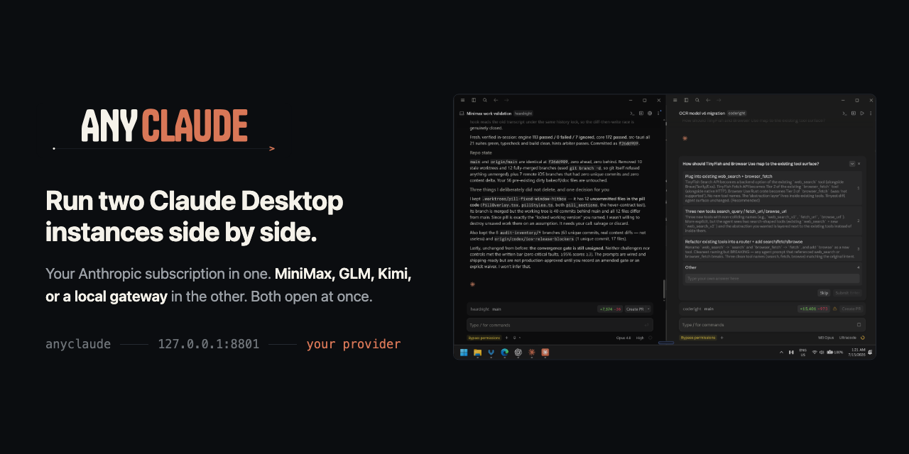

<h1 align="center">
  
</h1>

<p align="center">
  Use your Anthropic subscription in the first. Use MiniMax M3 or another third-party Anthropic-compatible provider in the second.<br>
  <strong>Both stay open on the same computer.</strong><br>
  The second instance talks to the provider you configure, so its work does not draw down your Anthropic usage limits.
</p>

<p align="center">
  <a href="#set-up-the-second-claude-instance"><strong>Set up the second instance</strong></a> ·
  <a href="#how-it-works">How it works</a> ·
  <a href="#how-tos">How-tos</a> ·
  <a href="#provider-status">Provider status</a> ·
  <a href="docs/windows.md">Windows</a> ·
  <a href="docs/macos.md">macOS</a> ·
  <a href="CHANGELOG.md">Changelog</a>
</p>

<p align="center">
  <sub>Real proof, in the card above: left is subscription Claude on Opus 4.8, right is an isolated anyclaude profile on MiniMax M3, and the taskbar shows both running at once.</sub>
</p>

### Your Claude stays your Claude

anyclaude does not replace, patch, or reroute your subscription Claude. The launcher opens a second, isolated Claude profile pointed at another model provider, so both windows remain open and work independently.

## What you get

| Your regular Claude | Your second Claude |
|---|---|
| Opens normally | Opens from the **anyclaude** shortcut |
| Uses your Anthropic subscription | Uses MiniMax, GLM, Kimi, LiteLLM, vLLM, or a local gateway |
| Keeps its existing chats, projects, and settings | Separate Desktop, Claude Code, and Cowork state; shares your `~/.claude` skills and subagents |
| Runs Anthropic models | Runs the upstream model you configure |
| **Stays open** | **Runs beside it at the same time** |

Three reasons people run the second instance:

- **Keep working after you hit a limit.** The second window bills to your provider, not to Anthropic, so a long or repetitive job there leaves your subscription capacity intact.
- **Work on two things at once.** Two live sessions, two repositories, one desktop.
- **Compare models on the same task.** Same interface, same prompt, different upstream model.

You keep the Claude interface and workflows you already know without committing the whole app to one provider.

## Features

- **Two Claude Desktop instances at once.** Subscription Claude and an isolated anyclaude instance on a third-party provider, live together on one machine, each with its own profile.
- **Claude Code through the proxy, interactive or headless.** Point Claude Code's `ANTHROPIC_BASE_URL` at the local proxy to run the CLI on the provider: an interactive session, or a scripted `claude -p` run for pipes and CI, beside a separate subscription terminal.
- **Any Anthropic-compatible provider.** MiniMax, GLM, Kimi, LiteLLM, vLLM, or a local gateway. Each is one small JSON template in [`examples/`](examples/); adding one is a template plus a verification run.
- **Per-model routing and thinking policy.** Map different incoming Claude model names to different upstream models or thinking modes (`adaptive`, `disabled`).
- **No fork, no patch.** A standard-library Python proxy that only renames the model and forwards the request. It binds to `127.0.0.1`, and your provider key stays in an environment variable.

Setup is below. Per-task how-tos (interactive CLI, headless CLI, adding a provider) are in [How-tos](#how-tos).

## Set up the second Claude instance

You need Python 3.9+, Claude Desktop, and an API key for an Anthropic-compatible endpoint. The proxy is standard-library Python: there is no `pip install`, Claude fork, patched binary, or second Electron download.

### 1. Clone and choose a provider

```bash
git clone https://github.com/bogusyogi/anyclaude.git
cd anyclaude
cp examples/minimax.json config.json
```

On Windows PowerShell, use `Copy-Item examples\minimax.json config.json`. Templates for GLM, Kimi, and local gateways are also in [`examples/`](examples/). `config.json` is ignored by Git.

### 2. Save the provider key

macOS or Linux:

```bash
export MINIMAX_API_KEY="sk-..."
```

Windows PowerShell:

```powershell
setx MINIMAX_API_KEY "sk-..."
```

The name must match `upstream.key_env` in `config.json`. The key stays in your environment and is never written into the Desktop Gateway config.

### 3. Install the isolated launcher

#### Windows

```powershell
powershell -ExecutionPolicy Bypass -File windows\install.ps1
```

This adds an **anyclaude** Desktop/Start shortcut and registers the local proxy to start at login. Open Claude normally, then open **anyclaude**. They receive separate taskbar identities and isolated profiles. See the [Windows guide](docs/windows.md) for exactly what changes and how to remove it.

Both official Windows install types are supported: Microsoft Store/MSIX and Anthropic's updater-managed Windows installer. anyclaude resolves the current signed Claude version on every launch, so the second instance follows normal Claude Desktop updates automatically.

#### macOS

Start the proxy in one terminal:

```bash
python3 proxy.py
```

Then install and open the isolated launcher:

```bash
./mac/anyclaude-macos.sh --install-app
./mac/anyclaude-macos.sh
```

Open Claude normally, then open `/Applications/anyclaude.app`. See the [macOS guide](docs/macos.md) for profile isolation, login startup, and the optional ask-on-sandbox-escape policy.

### 4. Verify it

```bash
curl -fsS http://127.0.0.1:8801/health
```

`"status": "ok"` proves the local proxy is ready without spending an inference request. Open both applications and confirm the normal window shows your Anthropic model while the anyclaude window shows the Gateway model label.

<details>
<summary><strong>Run one real provider request</strong></summary>

```bash
curl -fsS http://127.0.0.1:8801/v1/messages \
  -H "anthropic-version: 2023-06-01" \
  -H "content-type: application/json" \
  -d '{"model":"claude-opus-4-8","max_tokens":16,"messages":[{"role":"user","content":"ping"}]}'
```

Success means the response names the upstream model and `proxy.log` records `status=200`. This consumes a small provider inference call.

</details>

## How it works

Claude Desktop's Gateway mode speaks the Anthropic Messages API but requires Anthropic-shaped `claude-*` model names. Many compatible providers expose the same API under names such as `MiniMax-M3`, `glm-*`, or `kimi-*`.

```text
subscription Claude ───────────────────────────→ Anthropic

isolated anyclaude Desktop ─→ 127.0.0.1:8801 ─→ your provider
                              rename model only
```

`proxy.py` listens only on localhost, replaces the incoming model name with the configured upstream name, applies the selected thinking policy, and forwards the request with the provider key from your environment. The second-instance launchers give Claude a separate profile rather than changing the subscription profile.

<details>
<summary><strong>Example config.json</strong></summary>

```json
{
  "port": 8801,
  "upstream": {
    "host": "api.minimax.io",
    "prefix": "/anthropic",
    "scheme": "https",
    "auth_header": "x-api-key",
    "key_env": "MINIMAX_API_KEY"
  },
  "models": {
    "default": { "name": "MiniMax-M3", "thinking": "adaptive" },
    "haiku": { "name": "MiniMax-M3", "thinking": "disabled" }
  }
}
```

`models` matches keywords in the incoming Claude model name; `default` is the fallback. Routes may point to different upstream models or thinking policies.

</details>

## Provider status

| Provider | Endpoint | Status |
|---|---|---|
| **MiniMax M3** | `api.minimax.io/anthropic` | **Verified:** Claude Code + Desktop, Windows + macOS |
| Zhipu **GLM** | `open.bigmodel.cn/api/anthropic` | Example config; not yet tested |
| Moonshot **Kimi** | `api.moonshot.ai/anthropic` | Example config; not yet tested |
| **Local gateway** | `127.0.0.1:<port>` | Example config; not yet tested |

Only MiniMax is currently verified. The other entries are compatible configurations, not support claims.

**Adding a provider is a JSON template plus a verification run.** Any Anthropic-compatible endpoint can be a new row here. See [CONTRIBUTING.md](CONTRIBUTING.md) for the template fields, the `/v1/messages` check that counts as proof, and how to move a row from untested to verified.

## How-tos

### Run Claude Code through the proxy (interactive)

Keep plain `claude` on your Anthropic subscription. Give the proxied route its own command by wrapping the environment in a shell function, so you never re-export by hand.

Add to `~/.zshrc` or `~/.bashrc`:

```bash
anyclaude-code() {
  ANTHROPIC_BASE_URL="http://127.0.0.1:8801" \
  ANTHROPIC_AUTH_TOKEN="router-dummy" \
  ANTHROPIC_MODEL="claude-opus-4-8" \
  ANTHROPIC_DEFAULT_HAIKU_MODEL="claude-haiku-4-5-20251001" \
  claude "$@"
}
```

Windows PowerShell (add to `$PROFILE`):

```powershell
function anyclaude-code {
  $env:ANTHROPIC_BASE_URL="http://127.0.0.1:8801"
  $env:ANTHROPIC_AUTH_TOKEN="router-dummy"
  $env:ANTHROPIC_MODEL="claude-opus-4-8"
  $env:ANTHROPIC_DEFAULT_HAIKU_MODEL="claude-haiku-4-5-20251001"
  claude @args
}
```

Run `anyclaude-code`. `/status` shows the localhost proxy URL. It runs beside a separate subscription-backed `claude` terminal just as the two Desktop windows do.

### Run Claude Code headlessly (scripted)

The same function drives non-interactive runs. `claude -p` prints one response and exits, so provider-billed work goes in scripts, pipes, and CI:

```bash
anyclaude-code -p "Summarize this diff in three bullets" < changes.patch
git log -1 --format=%B | anyclaude-code -p "Write a release note for this commit"
```

Because these bill to your provider, they are a cheap way to run bulk or repetitive Claude Code jobs without spending Anthropic subscription capacity. Add `--output-format json` when a script needs to parse the result.

### Add another provider

Any Anthropic-compatible endpoint can be a new route:

```bash
cp examples/minimax.json config.json      # start from the verified reference
```

Edit `upstream` (`host`, `prefix`, `scheme`, `auth_header`, `key_env`) and the `models` map to the provider's real model names, save the key in the environment variable named by `key_env`, restart `python3 proxy.py`, then confirm a real request returns the provider's model:

```bash
curl -fsS http://127.0.0.1:8801/v1/messages \
  -H "anthropic-version: 2023-06-01" -H "content-type: application/json" \
  -d '{"model":"claude-opus-4-8","max_tokens":16,"messages":[{"role":"user","content":"ping"}]}'
```

Full field reference and the rule for moving a provider from untested to verified are in [CONTRIBUTING.md](CONTRIBUTING.md).

<details>
<summary><strong>Point the stock Desktop app directly at anyclaude instead</strong></summary>

If you do not need simultaneous Desktop windows, open **Developer → Configure Third-Party Inference** and use:

| Setting | Value |
|---|---|
| Provider | Gateway |
| Base URL | `http://127.0.0.1:8801` |
| Credential kind | Static API key |
| API key | `router-dummy` |
| Auth scheme | `x-api-key` |
| Model discovery | Off |

Add Anthropic-shaped model names such as `claude-opus-4-8` and `claude-haiku-4-5-20251001`. Switch the provider back to Anthropic to restore the normal app.

</details>

## Troubleshooting

### `CONNECT tunnel failed, response 403`

Claude Desktop can inject a managed sandbox policy that allows only Anthropic and localhost. “Bypass permissions” does not override that network policy. Use the [macOS ask-on-escape fix](docs/macos.md#make-blocked-bash-operations-ask-instead-of-hard-deny) to retain sandboxing while restoring approval prompts.

### A folder is skipped because it is protected or is the home/root directory

Older launchers let Claude Code or Cowork state overlap the selected workspace. Current launchers place Desktop, Claude Code, and default Cowork state inside the isolated anyclaude profile on both Windows and macOS.

### Desktop “Test connection” fails

Many gateways do not expose `/v1/models`, which Desktop probes. Use `/health`, the real Messages API request above, or confirm `status=200` in `proxy.log`.

### Your skills or subagents are missing in the anyclaude window

Both launchers link `~/.claude/skills` and `~/.claude/agents` into the isolated profile on every start, so the library you already have resolves in both instances. If a skill is still missing, confirm it exists in `~/.claude` and that nothing has replaced the link with a real directory, which the launcher will not overwrite.

`settings.json` is deliberately not linked. It commonly pins an Anthropic-only model name, which the gateway provider does not serve, so sharing it would break the second instance. The cost is that hooks defined there do not run in the anyclaude window. Set `ANYCLAUDE_SHARE_CLAUDE_CODE=0` if you want a fully sealed profile with no sharing at all.

### A `Claude-3p` directory appears

The second-instance isolation did not apply. Stop the gateway instance and check that your Claude Desktop build still supports `CLAUDE_USER_DATA_DIR`. Both launchers stop with a warning when that support disappears rather than silently opening your subscription profile.

### The app cannot see the provider key

The Windows launcher reads user-level variables created by `setx`. On macOS, GUI launchers do not reliably inherit `~/.zshrc`; keep the proxy running separately or put the export in the login environment used by its service, commonly `~/.zprofile`. Never put the real key in Desktop's Gateway API-key field; that field remains `router-dummy`.

## Project map

| Path | Purpose |
|---|---|
| `proxy.py` | Local model-name and thinking-policy proxy |
| `examples/` | Provider configuration templates |
| `configLibrary/` | Secret-free Claude Desktop Gateway seed |
| `windows/` | Windows launcher, installer, and separate taskbar identity |
| `mac/` | Isolated macOS launcher |
| `docs/windows.md` | Windows setup, isolation, and uninstall guide |
| `docs/macos.md` | macOS setup and sandbox policy |
| `CHANGELOG.md` | User-visible fixes and changes by date |
| `BRAND.md` | Wordmark, color, composition, and voice rules |
| `CONTRIBUTING.md` | How to add a provider and run the checks |
| `tests/` | Offline regression checks for launcher invariants |
| `AGENTS.md` | Repository contract and verification commands for coding agents |

## Security

- The provider key is read from the named environment variable and is never required in a tracked file.
- The proxy binds to `127.0.0.1`, not the LAN.
- `config.json`, `.env`, keys, and logs are ignored by Git.
- The second Desktop profile is isolated, but it still acts with your operating-system account's permissions.
- Keep Claude Code sandboxing enabled for untrusted repositories and treat approval prompts as security decisions.
- Review provider terms and data handling before sending code or prompts upstream.

## License

MIT. Independent community software; not affiliated with Anthropic or any model provider. MiniMax [documents Claude Code use](https://platform.minimax.io/docs/token-plan/claude-code); verify the current terms and endpoints for your provider.
